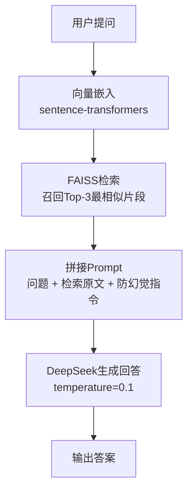

```
# RAG 文档问答系统
基于向量检索的 PDF 智能问答系统。上传 PDF，用自然语言提问，系统自动检索文档相关片段并生成回答。

## 技术栈
| 模块 | 工具 | 说明 |
| :--- | :--- | :--- |
| PDF解析 | pdfplumber | 高质量提取PDF文本 |
| 向量嵌入 | sentence-transformers | 文档/问题向量化 |
| 向量检索 | faiss-cpu | IndexFlatIP（内积相似度） |
| 大模型 | DeepSeek Chat API | temperature=0.1，保证回答稳定 |
| 网络加速 | hf-mirror.com | HuggingFace国内镜像，解决模型下载超时 |

## 📜 工作流程


## ✨ 功能特性

- ✅ 本地解析 PDF 文档，无需上传到第三方平台
- ✅ 内存向量库 Faiss，不需要额外部署独立向量数据库
- ✅ 基于文档上下文回答，降低大模型幻觉
- ✅ 模块化代码：解析、分块、检索逻辑分离，方便二次修改与扩展

## 📁 目录结构

```
rag-qa-system/
├── .gitignore          # Git忽略文件配置
├── README.md           # 项目说明文档
├── parser.py           # PDF解析模块，提取PDF文本
├── chunker.py          # 文本分块模块，长文本切分（支持重叠分块）
├── retriever.py        # 向量库构建、检索、调用DeepSeek API主逻辑
├── test.pdf            # 测试用PDF文件
└── .env                # 环境变量文件（存放API密钥，不上传git）
```

## 🚀 快速开始

### 1. 环境准备

> 
> 要求 Python 3.8+

```
pip install pdfplumber sentence-transformers faiss-cpu requests python-dotenv
```

### 2. 配置 API Key

> 
> ❗ **禁止直接把密钥硬编码写进代码上传仓库**

1. 在项目根目录新建 `.env` 文件
2. 在 `.env` 文件写入下面内容，替换为你自己的密钥

```
DEEPSEEK_API_KEY="你的DeepSeek API Key"
```

3. `.env` 文件已加入 `.gitignore`，不会被提交到代码仓库。

### 3. 运行项目

```
python retriever.py
```

## 💡 使用示例

> 
> 示例输入：
> 
> 
> ```
> 这份文档的核心结论是什么？
> ```
> 
> 
> 示例输出：
> 
> 
> ```
> 根据文档第3页内容，文档核心结论为：xxxxxxx
> ```

## ⚠️ 项目局限

- 当前仅支持 PDF 格式文档
- 向量库保存在内存，程序退出后向量丢失，暂不支持持久化存储
- 使用基础相似度检索，未加入 Rerank 重排模块，超长文档场景召回精度有限
- 当前为命令行交互模式

## 📌 后续可扩展方向

1. 增加文本重排器 `bge-reranker`，提升检索片段准确率
2. 将 Faiss 索引持久化保存，每次启动无需重复向量化文档
3. 开发 Gradio 网页 UI，浏览器直接上传 PDF、在线提问
4. 支持 Word、TXT 等更多文档格式解析
5. 增加日志系统、异常捕获，处理 PDF 损坏、API 调用超时等异常场景

```

---

# 配套 .gitignore（完整版本，替换你原来的）
```gitignore
# python
__pycache__/
*.pyc
*.pyo
*.pyd
venv/
.venv/
*.egg-info/
dist/
build/

# env
.env

# faiss index cache
*.index

# logs
*.log

# IDE
.idea/
.vscode/
```

# retriever.py 密钥读取代码片段（放到 retriever.py 头部）

```
from dotenv import load_dotenv
import os

# 加载根目录下 .env 文件
load_dotenv()
DEEPSEEK_API_KEY = os.getenv("DEEPSEEK_API_KEY")

if not DEEPSEEK_API_KEY:
    raise ValueError("请在项目根目录 .env 文件中配置 DEEPSEEK_API_KEY")
```
